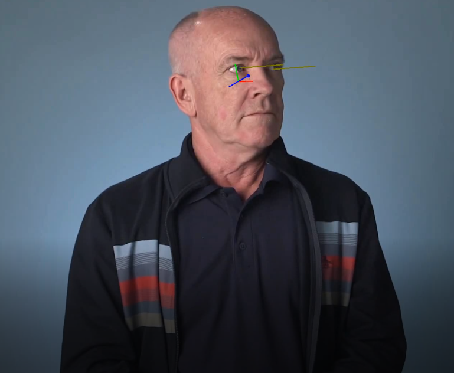
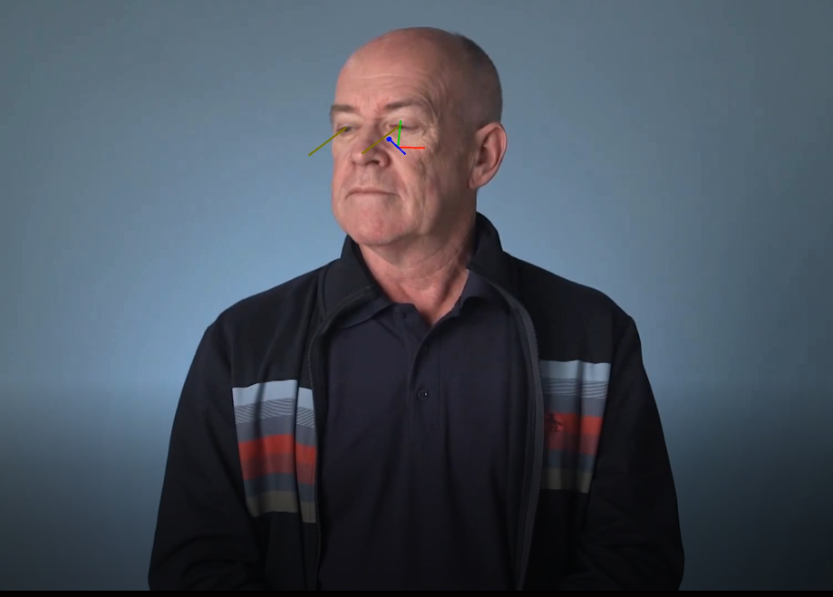

# Computer Pointer Controller

This project implements controlling computer mouse pointer using a person's eye gaze. This is achieved by impementing a inference pipeline where following is done.
1. Detect face in the video frame.
2. Use detected face to estimate head pose.
3. Use detected face to get landmarks of face (*left eye & right eye*).
4. Use head pose & two eyes to estimate gaze vector.
5. Use gaze vector to controll mouse pointer.

## Project Set Up and Installation
#### Prerequisite
* OpenVINO 2020.1 Installed machine. Instruction [here](https://docs.openvinotoolkit.org/2020.1/index.html).

* python 3.8
* python virtual environment installed.
    ```
    python3 -m pip install --user virtualenv
    ```  
#### Download models
* Go to the directory called **models**.
  ```
  cd <repository_path>/models
  ```
* Download the required models in to this folder.
    ```
    python <openvino_model_downloader_path>\downloader.py --name face-detection-adas-0001
    python <openvino_model_downloader_path>\downloader.py --name head-pose-estimation-adas-0001
    python <openvino_model_downloader_path>\downloader.py --name landmarks-regression-retail-0009
    python <openvino_model_downloader_path>\downloader.py --name gaze-estimation-adas-0002
    ```
* Refer [here]() to get more info on model input & output parameters.
#### Directory structure
* The cloned repository has the following structure after models are downloaded.
  ```
    .
    ├── bin
    │   └── demo.mp4
    ├── models
    │   └── intel
    │       ├── face-detection-adas-0001
    │       │   ├── FP16
    │       │   ├── FP16-INT8
    │       │   └── FP32
    │       ├── gaze-estimation-adas-0002
    │       │   ├── FP16
    │       │   ├── FP16-INT8
    │       │   └── FP32
    │       ├── head-pose-estimation-adas-0001
    │       │   ├── FP16
    │       │   ├── FP16-INT8
    │       │   └── FP32
    │       └── landmarks-regression-retail-0009
    │           ├── FP16
    │           ├── FP16-INT8
    │           └── FP32
    ├── README.md
    ├── requirements.txt
    ├── src
    │   ├── debug_utils.py
    │   ├── face_detection.py
    │   ├── facial_landmarks_detection.py
    │   ├── gaze_estimation.py
    │   ├── head_pose_estimation.py
    │   ├── input_feeder.py
    │   ├── model.py
    │   ├── mouse_controller.py
    │   ├── pipeline.py
  ```
#### Setup Virtual Environment
* Come back to the top directory in the repository. There is a requirement.txt file here.
* Create & activate virtual env.
    ```
    python3 -m venv env
    source env/bin/activate
    ```
* Install prerequisites
    ```
    pip install -r .\requirements.txt
    ```

## Demo
* Go to ```src``` directory.
    ```
    cd src
    ```
* Run ```pipeline.py``` python script.
    ```
    python3.8 pipeline.py -i ../bin/demo.mp4
    ```
* When this is run the mouse pointer would be controlled according to the given video.

## Documentation
* The pipeline.py takes flollowing arguments.  
    |flag | Meaning |
    |---|---|
    | -i  | Used to point to video file   |
    |  -d | Used to define the device for models to run |
    |-e | CPU extension if necessary|
    |-s | Used to set debug flag. If this is set to 1 ```debug_out.avi``` file is created inside src directory. When debugging, mouse pointer controlling would not be done. |
* Setting debug flag as mentioned above would create a video. It will have the intermediate models visualised. Following images are extracted from it.  
    
    

## Benchmarks

#### Face Detection model
| Precision | Throuput(FPS) | Latency (ms) |
|---|---|---|
| FP32 | 35 | 26.45|
| FP16 | 39 | 24.2 |
| INT8 | 50 | 17.7 |
#### Head Pose Estimation model
| Precision | Throuput(FPS) | Latency (ms) |
|---|---|---|
| FP32 | 539 | 1.57|
| FP16 | 556 | 1.54 |
| INT8 | 994 | 0.82 |

#### Facial Landmark Detection
| Precision | Throuput(FPS) | Latency (ms) |
|---|---|---|
| FP32 | 1930 | 0.4|
| FP16 | 1920 | 0.4 |
| INT8 | 2094 | 0.36 |
## Results
The difference in inference time for different precisions can be explained by the time the CPU would take to do the calculation. Higher the precision, CPU would need more CPU cycles to do the Floating Point Operations(FLOPs). This will result in higher latencies. In the same time, higher precision would yield better accuracy. So inference time & accuracy should be balanced to get the desired output.
